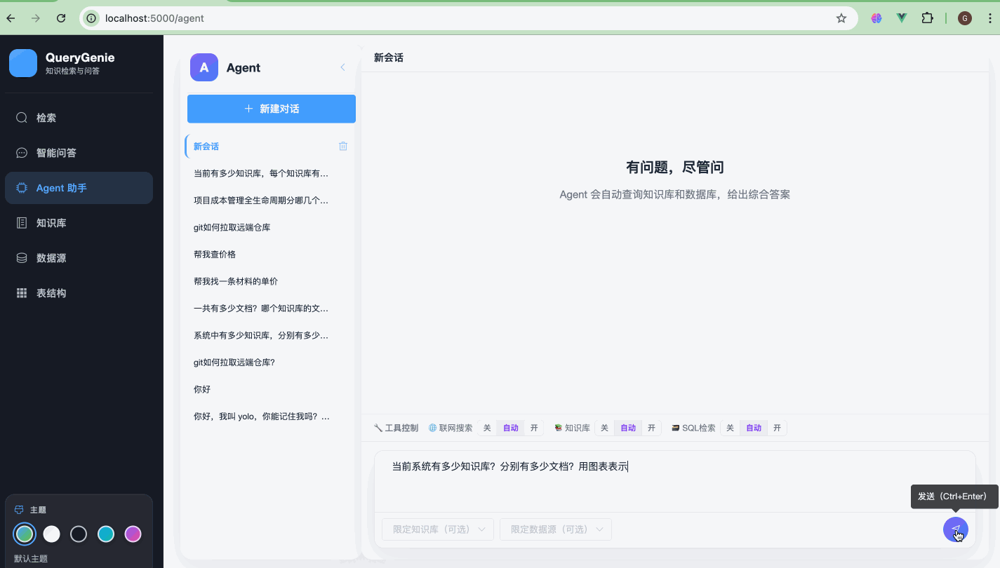
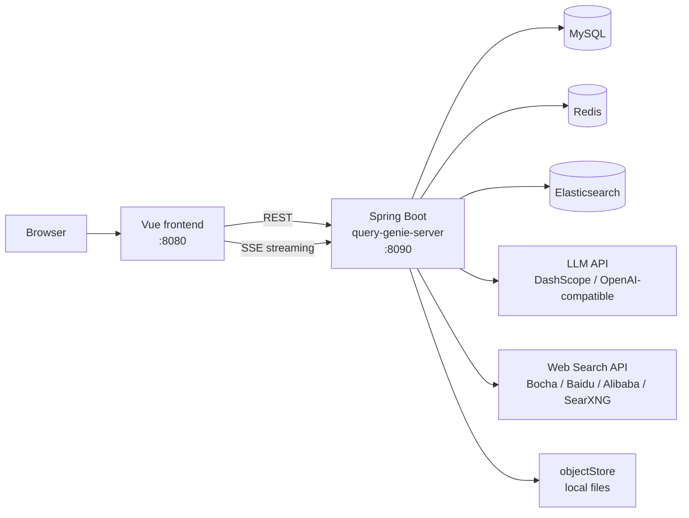
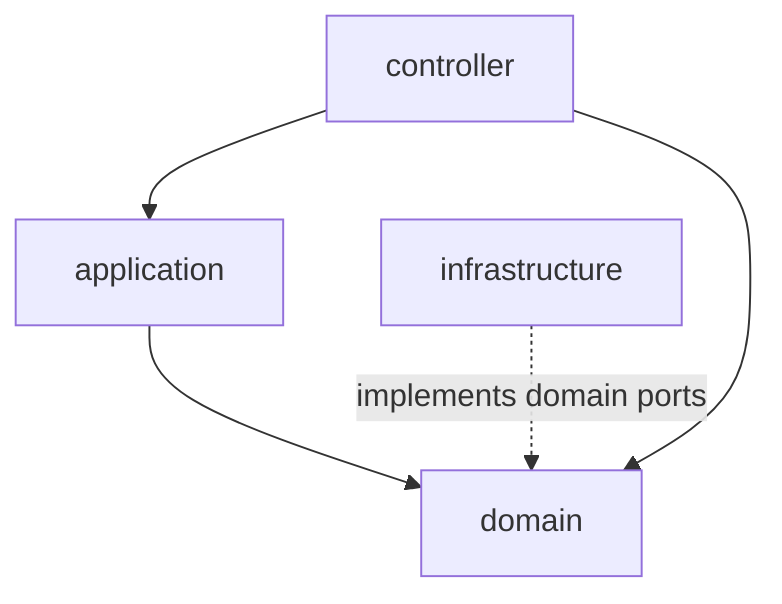
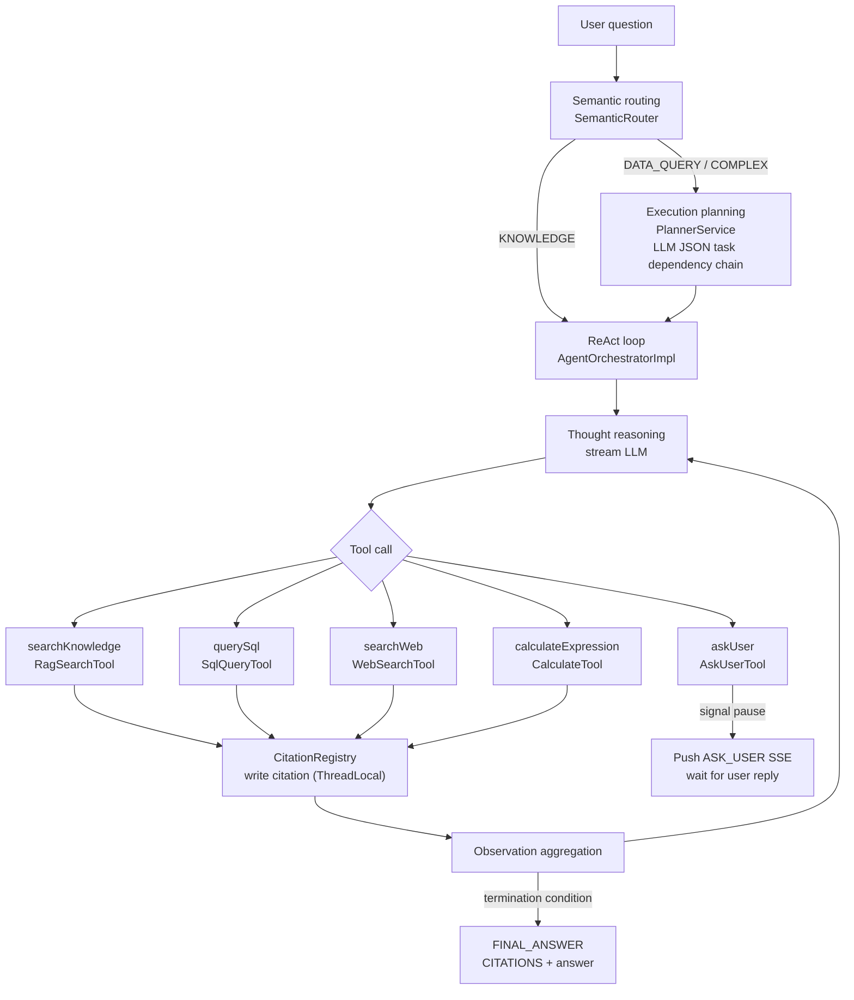
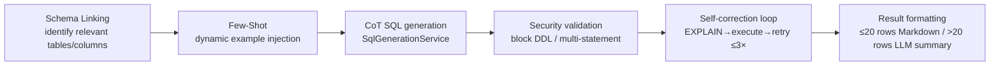

# QueryGenie

An engineering-oriented **AI Q&A** system for enterprise knowledge bases and database-backed scenarios. It covers the full path from document ingestion through hybrid retrieval and streaming answers to multi-tool Agent reasoning, with DDD layering for long-term maintainability.

**Highlights:** multi-format documents (docs, spreadsheets, web pages); field weighting, time decay, hybrid retrieval, query rewrite, multi-turn conversations; ReAct Agent (KB search + SQL query + precise calculation + web search + ask-user); ECharts data charts; feedback-driven FewShot self-learning; SSE step-by-step streaming; citation tracing.

[中文说明](./README.md)

## Demo

Screen recording of QueryGenie in use: knowledge base management, retrieval, and streaming Q&A.




## Why QueryGenie

Many RAG demos run end-to-end but are hard to evolve in production. QueryGenie focuses on practical engineering:

- **End-to-end workflow:** KB management → parsing/chunking → retrieval → rerank → streaming QA → Agent multi-tool reasoning  
- **Evolvable architecture:** clear Controller / Application / Domain / Infrastructure boundaries  
- **Replaceable infrastructure:** model provider, vector retrieval, cache, middleware, and web search vendor can be swapped in the infrastructure layer  

## Why It Is Valuable As Open Source

| Dimension | Notes |
|-----------|-------|
| Scenario | Not a single chatbot demo—a full knowledge production workflow |
| Engineering | DDD layering plus architecture guard tests for collaboration and refactors |
| Product | Hybrid retrieval, rerank, and streaming answers for realistic UX |
| Agent | ReAct multi-tool loop + ask-user + citation tracing for complex reasoning |
| Self-learning | User thumbs-up drives FewShot writes to ES; similar questions auto-inject good SQL examples for continuous improvement |
| Extension | ToolRegistry SPI + middleware chain—add new tools or cross-cutting logic without touching the orchestrator |
| Evolution | Clear infra abstractions for new model vendors and retrieval backends |

## Core Features

**Knowledge Base Q&A (RAG)**

- **Knowledge base management:** create, edit, publish, delete; configurable searchable fields and weights  
- **Document ingestion:** local files plus remote sources (web / Yuque)—parse, chunk, vectorize, and index  
- **Retrieval:** keyword, vector, hybrid (RRF); optional reranking; time decay  
- **RAG Q&A:** retrieval-grounded answers; SSE streaming; multi-turn sessions  

**Agent Reasoning (ReAct)**

- **Semantic routing:** automatically identifies question type (KB / data query / complex) and selects execution strategy  
- **Execution planning:** LLM decomposes complex questions into a dependency-linked task list  
- **ReAct loop:** Thought → Action (tool call) → Observation iterative reasoning  
- **Five tools:** KB search, SQL query (5-step pipeline), precise calculation, web search, ask-user  
- **SQL query:** Schema Linking → Few-Shot → CoT generation → security validation → self-correction loop (≤3 retries) → result formatting  
- **Precise calculation:** `CalculateTool` powered by exp4j; supports arithmetic, exponentiation, sqrt/log/abs and more; `alwaysLoad=true`  
- **Data visualization:** Agent emits a ` ```chart ` JSON code block; frontend auto-renders ECharts charts (line, bar, pie, etc.)  
- **Feedback self-learning:** thumbs-up triggers async FewShot write to ES vector store; similar questions auto-inject high-quality SQL examples on next retrieval  
- **Web search:** supports Bocha AI / Baidu AI Search / Alibaba IQS / SearXNG—switchable by config  
- **Citation tracing:** clickable [N] superscripts in answers open a detail drawer for KB / SQL / WEB sources  
- **SSE step stream:** ROUTING → PLANNING → THINKING → TOOL_CALL → TOOL_RESULT → CITATIONS → FINAL_ANSWER  
- **Tool SPI:** `AgentToolMeta` annotation + `ToolRegistry`—add a new tool by implementing `AgentTool` and registering it as a Bean, no orchestrator changes needed  
- **Middleware chain:** `AgentMiddleware` SPI + `MiddlewareChain`—cross-cutting concerns (history injection, planning, ask-user pause, title update) encapsulated independently  

## System Architecture

### Deployment and data flow

The browser loads the Vue SPA, which calls the Spring Boot REST/SSE APIs. The backend uses MySQL, Redis, and Elasticsearch, calls external LLM / rerank APIs, and stores uploaded documents under the local `objectStore` directory. In Agent mode it can also call an external web search API on demand.



Local middleware is defined in `docker-compose.yml` at the repo root (MySQL, Redis, Elasticsearch). **Elasticsearch requires the IK Chinese analysis plugin:** index mappings use `ik_smart` / `ik_max_word` (see `KLFieldMappingBuilder`). `docker compose` builds `docker/elasticsearch-ik/Dockerfile`, which installs a version-matched [analysis-ik](https://github.com/infinilabs/analysis-ik) for Elasticsearch 8.18.0. The first `./scripts/bootstrap.sh` or `docker compose up` may take longer while the image builds.

### Backend layering (DDD)

Business rules live in `domain`; `infrastructure` implements domain-facing interfaces so the domain does not depend on concrete vendors.



### Agent execution flow



### SQL query 5-step pipeline



## Repository Layout

Monorepo with a separate frontend and backend; the root holds orchestration and docs.

```
AIGenie/
├── query-genie-front/          # Vue 2 SPA (views, router, API clients)
├── query-genie-server/         # Spring Boot backend (DDD layers)
├── scripts/                    # Local helpers (e.g. bootstrap.sh)
├── docker/                     # Custom service images (ES + IK)
├── docker-compose.yml          # MySQL / Redis / Elasticsearch
├── .env.example                # Env template (copy to .env)
├── demo.gif                    # UI and Q&A demo (animated)
├── objectStore/                # Runtime document storage (objectStore/doc/ ignored by default)
├── LICENSE
├── README.md / README.en.md
```

### query-genie-front

| Path | Purpose |
|------|---------|
| `src/views/AgentChat.vue` | Agent chat page (session sidebar, step streaming, ask-user bubble, source links) |
| `src/views/Qa.vue` | Traditional RAG Q&A page (KB selection, streaming answer, citation sources) |
| `src/views/KnowledgeList.vue` / `KnowledgeDetail.vue` | KB list and detail (document management, field config) |
| `src/views/Search.vue` | Retrieval test page (multi-strategy comparison) |
| `src/views/Query.vue` | SQL query test page |
| `src/views/DatasourceList.vue` | Data source management page |
| `src/views/TableSchemaList.vue` / `TableSchemaEdit.vue` | Table schema management pages |
| `src/components/CitationText.vue` | Renders [N] superscripts in answers (clickable, emits cite-click); intercepts ` ```chart ` blocks and renders ECharts charts |
| `src/components/CitationDrawer.vue` | Citation source drawer (KB / SQL / WEB type-specific styles) |
| `src/components/ChartRenderer.vue` | ECharts chart wrapper (ResizeObserver auto-resize, reactive option prop) |
| `src/api/` | Backend API wrappers (`agent.js` / `qa.js` / `session.js` / `knowledge.js`, etc.) |
| `src/router/` | Vue Router configuration |

### query-genie-server

#### controller layer

| Class | Purpose |
|-------|---------|
| `AgentController` | `POST /agent/ask/stream` — SSE streaming Agent Q&A, 120 s timeout |
| `FeedbackController` | `POST /agent/feedback` — receives thumbs-up/down, triggers async FewShot write |
| `QaController` | RAG Q&A, streaming answer, history query |
| `KnowledgeController` | KB CRUD + publish management |
| `DocumentController` | Document upload and parse task management |
| `QueryController` | SQL query endpoint |
| `SchemaController` | Data source and table schema management |
| `SqlTestController` | Internal SQL end-to-end test (requires `app.internal-api.enabled`) |

#### application layer

| Class | Purpose |
|-------|---------|
| `AgentApplication` | Agent request dispatch, message persistence (with `citationsJson`), session title update |
| `FeedbackApplication` | Feedback handling: sync DB write + on thumbs-up async extract SQL citation → rewrite question → write FewShot pair to ES vector store |
| `QaApplication` | RAG Q&A use-case orchestration (retrieval → rerank → LLM → streaming) |
| `SessionApplication` | Session / message list query, historical citation parsing (backward-compatible with QA sources) |
| `DocumentApplication` | Document ingestion ETL orchestration |
| `KnowledgeApplication` | KB lifecycle use cases |
| `SchemaApplication` | Schema sync and cache refresh |
| `QueryApplication` | SQL query use case |

#### domain layer

| Sub-package | Purpose |
|-------------|---------|
| `agent/routing/` | Semantic routing: `SemanticRouter` (keyword rules + LLM fallback), `QuestionType` (KNOWLEDGE / DATA_QUERY / COMPLEX) |
| `agent/planning/` | Execution planning: `PlannerService` / `DefaultPlannerService` (LLM JSON output), `ExecutionPlan` (task dependency chain + `toTaskListHint()`) |
| `agent/orchestration/` | ReAct orchestration: `AgentOrchestrator` / `AgentOrchestratorImpl` (reasoning loop + streaming LLM), `AgentContext`, `AgentResult` (finalAnswer + citations), `ContextWindowManager` (multi-turn token compression) |
| `agent/tool/` | Agent tools: `RagSearchTool` (KB search), `WebSearchTool` (web search, `@ConditionalOnBean`), `AskUserTool` (ask-user via signal string pause), `CalculateTool` (precise math via exp4j, `alwaysLoad=true`) |
| `agent/tool/spi/` | Tool SPI: `AgentTool` interface, `AgentToolMeta` annotation (name / group / alwaysLoad / forceable / toolForceField); `ToolRegistry` filters by business conditions and ToolForce reflection |
| `agent/middleware/` | Middleware chain: `AgentMiddleware` (SPI, before / after / onAskUserPause), `MiddlewareChain` (order-sorted execution); 4 built-in impls: `HistoryInjectMiddleware`, `PlanningMiddleware`, `PausedContextMiddleware`, `TitleMiddleware` |
| `agent/tool/sql/` | SQL tool entry point: `SqlQueryTool` (pipeline orchestrator), `SqlExecutor` (interface) |
| `agent/tool/sql/pipeline/` | SQL 5-step pipeline: `SchemaLinkingService`, `DynamicFewShotService` (ES kNN retrieval of historical Q→SQL pairs, controlled by `app.fewshot.es.enabled`), `SqlGenerationService` (CoT), `SqlSecurityValidator`, `SelfCorrectionLoop` (EXPLAIN + retry), `ResultFormatter`, `SchemaContextBuilder` |
| `agent/event/` | SSE step events: `StepEvent` (ROUTING / PLANNING / THINKING / THOUGHT_CHUNK / TOOL_CALL / TOOL_RESULT / ASK_USER / CITATIONS / FINAL_ANSWER / ERROR), `StepEventPublisher` |
| `agent/citation/` | Citation registry: `CitationRegistry` (ThreadLocal write / drainAndClear), `CitationItem` (unified KB / SQL / WEB model) |
| `agent/search/` | Web search domain interfaces: `WebSearchProvider`, `WebSearchResult` |
| `knowledge/` | KB domain model, repository interfaces, field weight config |
| `document/` | Document domain model, parse result |
| `etlpipeline/` | ETL pipeline (chunking, vectorization, indexing) |
| `qa/` | RAG Q&A domain (retrieval params, QA result, multi-turn context) |
| `query/` | SQL query domain (data source, execution result) |
| `schema/` | Database schema domain (tables, columns, summaries) |
| `vectorstore/` | Vector store abstractions (index build, vector search, hybrid search) |
| `chat/` | Session / message domain model (`ChatMessage` with `citationsJson` field) |

#### infrastructure layer

| Sub-package | Purpose |
|-------------|---------|
| `llm/dashscope/` | DashScope LLM adapter (`ChatModel`, `EmbeddingModel`) |
| `llm/openai/` | OpenAI-compatible LLM adapter (query rewrite, etc.) |
| `search/` | Web search providers: `BochaSearchProvider`, `BaiduAISearchProvider`, `AliIQSSearchProvider`, `SearxngSearchProvider`; `WebSearchProviderFactory` (`@ConditionalOnProperty`) creates the active bean by config |
| `datasource/` | Dynamic data sources: `DynamicDataSourceManager` (Druid pool on-demand + cache, AES password decryption), `SqlExecutorImpl` |
| `vectorstore/` | Elasticsearch vector search implementation (IK tokenization, hybrid RRF, field weighting) |
| `rerank/` | Rerank service implementations (DashScope, etc.) |
| `dao/` | MyBatis Mapper implementations (KB, document, session, message, etc.) |
| `cache/` | Redis cache implementation |
| `embedding/` | Embedding service implementation |
| `objectstore/` | Local object storage implementation |
| `api/` | External HTTP calls (document parsing, etc.) |

### docker/elasticsearch-ik

| Path | Purpose |
|------|---------|
| `Dockerfile` | Official `elasticsearch:8.18.0` plus IK plugin (plugin version aligned with ES) |

## Capability Matrix

| Area | Current capability | Notes |
|------|--------------------|-------|
| Ingestion | Local files + web / Yuque | Multi-format document parsing, chunking, vectorization |
| Retrieval | Keyword / Vector / Hybrid (RRF) | Direct strategy comparison |
| Ranking | DashScope Rerank + time decay | Better relevance and ranking stability |
| QA UX | SSE streaming + multi-turn sessions | Production-like user experience |
| Agent routing | Keyword rules + LLM fallback | Auto-classifies KB / data query / complex |
| Agent planning | LLM JSON task dependency chain | Complex questions decomposed into ordered subtasks |
| Agent tools | KB search / SQL query / precise calculation / web search / ask-user | ReAct multi-turn reasoning loop |
| SQL generation | CoT + self-correction ≤3× + security validation | Schema Linking + EXPLAIN verification |
| Data visualization | ECharts charts (line / bar / pie) | Agent emits ` ```chart ` block, frontend auto-renders |
| Web search | Bocha / Baidu / Alibaba / SearXNG | Provider switchable by config, optional |
| Feedback self-learning | Thumbs-up → FewShot → ES vector store | Similar questions auto-inject SQL examples; accuracy improves continuously |
| Citation tracing | [N] superscript + drawer detail | KB / SQL / WEB three-type citations |
| Architecture | DDD layers + ArchUnit constraints | Easier extension and long-term maintenance |
| Tool extension | ToolRegistry SPI + `@AgentToolMeta` | Add a tool by implementing an interface and registering a Bean—no orchestrator changes |
| Middleware extension | `AgentMiddleware` SPI + `MiddlewareChain` | Cross-cutting concerns independently encapsulated, ordered flexibly |

## Architecture Value

Backend follows DDD layering, keeping business rules free from infrastructure pollution:

- `controller`: request validation and HTTP exposure  
- `application`: use-case orchestration  
- `domain`: core business rules and abstractions  
- `infrastructure`: concrete implementations for MySQL / Redis / Elasticsearch / LLM  

The project includes an ArchUnit test to enforce layering boundaries:

- `query-genie-server/src/test/java/com/genie/query/architecture/LlmLayerDependencyArchTest.java`

## Difference From Typical RAG Demos

- Focus on the full workflow, not only answer generation  
- Keep domain logic out of ad-hoc controller code  
- Preserve extensibility for model, retrieval, and cache replacements  
- Goes beyond RAG with a complete Agent reasoning chain (routing → planning → ReAct → tools → citation tracing)  
- Pluggable tools (SPI registration)—add new tools without modifying the orchestrator  
- Middleware chain decouples cross-cutting concerns (history injection, planning, ask-user pause, title generation) with flexible ordering  
- Feedback flywheel: thumbs-up → FewShot write to ES → next similar question auto-injects example SQL → continuous improvement  

## Quick Start (10 minutes)

### 1) Prerequisites

- JDK 17+  
- Maven 3.6+  
- Node.js 16+  
- Docker / Docker Compose  

### 2) Configure environment variables

Copy the template:

```bash
cp .env.example .env
```

The backend auto-loads `.env` from the repo root or from `query-genie-server`.

At minimum set:

```bash
export DASHSCOPE_API_KEY=your-dashscope-api-key
```

For query rewrite via an OpenAI-compatible endpoint (optional):

```bash
export OPENAI_API_KEY=your-openai-compatible-api-key
```

To enable web search (one of the Agent tools), optionally set:

```bash
# Pick one provider (Bocha AI recommended)
export APP_WEB_SEARCH_ENABLED=true
export APP_WEB_SEARCH_PROVIDER=bocha   # bocha / baidu / ali / searxng
export BOCHA_API_KEY=your-bocha-api-key
```

To enable SQL FewShot self-learning (thumbs-up drives ES vector store), optionally set:

```bash
export APP_FEWSHOT_ES_ENABLED=true
export APP_FEWSHOT_ES_TOP_K=3   # max examples injected per query
```

### 3) Start dependencies and init DB

```bash
./scripts/bootstrap.sh
```

### 4) Start backend

```bash
cd query-genie-server
mvn spring-boot:run
```

Default API base: `http://localhost:8090/genie/api`

### 5) Start frontend

```bash
cd query-genie-front
npm install
npm run serve
```

Open `http://localhost:8080`.

## Configuration

- Runtime config: `query-genie-server/src/main/resources/application.yml`  
- Example config: `query-genie-server/src/main/resources/application.example.yml`  
- DB init SQL: `query-genie-server/src/main/resources/sql/init.sql`  
- Local dependencies: `docker-compose.yml`  

### Elasticsearch and IK analysis

- **Why IK is required:** Full-text fields use `ik_smart`; without the plugin, index creation fails.  
- **Docker Compose:** The `elasticsearch` service image `query-genie-elasticsearch:8.18.0-ik` is built from this repo, so you do not need to run `elasticsearch-plugin install` manually inside the container.  
- **Self-managed or hosted ES:** Install an IK build whose **major.minor.patch matches your Elasticsearch version**, following [infinilabs/analysis-ik](https://github.com/infinilabs/analysis-ik) (example: `bin/elasticsearch-plugin install --batch "https://get.infini.cloud/elasticsearch/analysis-ik/<your-es-version>"`). When you bump the ES version in `docker-compose.yml`, update the plugin URL in `docker/elasticsearch-ik/Dockerfile` accordingly.  
- **Upgrading from the old compose file:** If you previously ran the plain Elasticsearch image without IK, run `docker compose build elasticsearch && docker compose up -d` (or `./scripts/bootstrap.sh` again) to recreate `genie-es` with the new image. If some indices failed to create without IK, delete them when safe and let the app recreate them.  

### Web search providers

| Provider | Config value | Required env var | Notes |
|----------|-------------|-----------------|-------|
| Bocha AI | `bocha` | `BOCHA_API_KEY` | Default recommendation, good Chinese search quality |
| Baidu AI Search | `baidu` | `BAIDU_AI_SEARCH_API_KEY` | Baidu Qianfan platform |
| Alibaba IQS | `ali` | `ALI_IQS_API_KEY` | Alibaba Cloud intelligent search |
| SearXNG | `searxng` | `SEARXNG_BASE_URL` | Free self-hosted, no API key required |

## License

This project is licensed under the [MIT License](./LICENSE).
