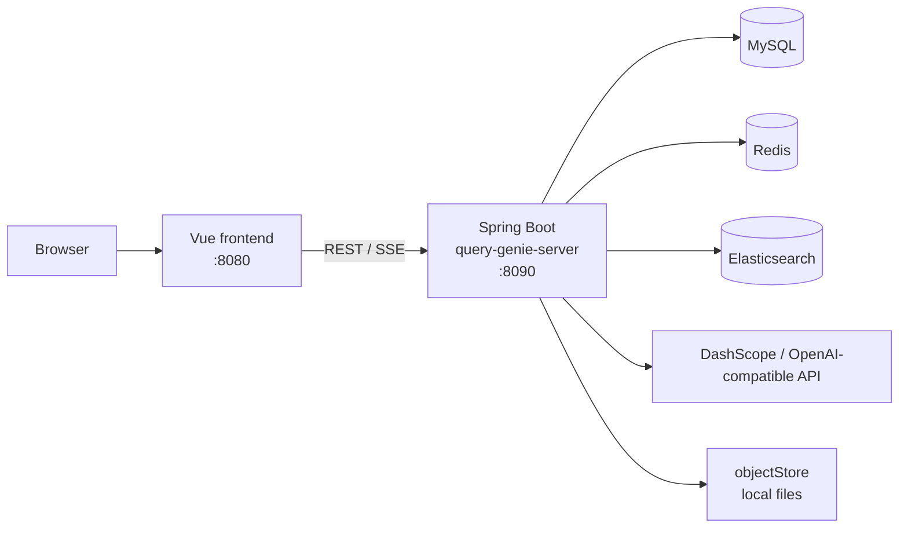
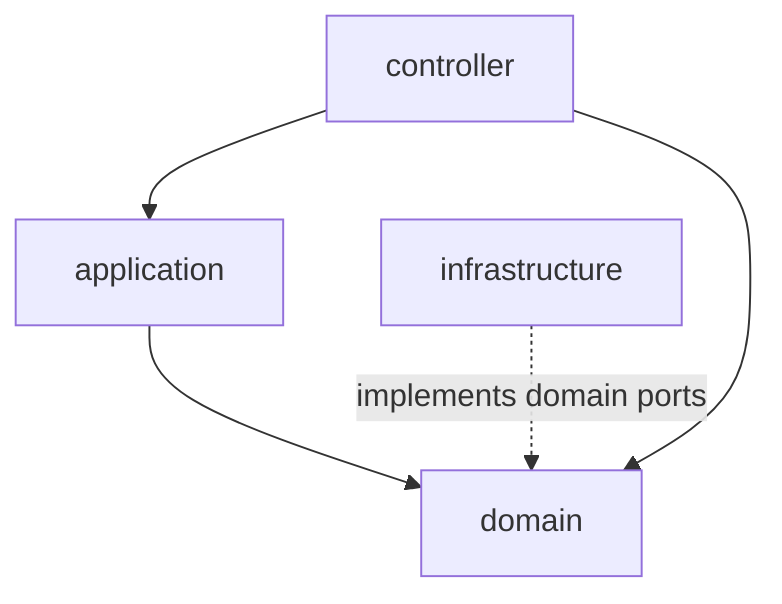

# QueryGenie

An engineering-oriented **AI Q&A** system for enterprise knowledge bases and database-backed scenarios. It covers the full path from document ingestion through hybrid retrieval to streaming answers, with DDD layering for long-term maintainability.

**Highlights:** multi-format documents (docs, spreadsheets, web pages); field weighting, time decay, hybrid retrieval, query rewrite, and multi-turn conversations.

[中文说明](./README.md)

## Demo

Screen recording of QueryGenie in use: knowledge base management, retrieval, and streaming Q&A.


## Why QueryGenie

Many RAG demos run end-to-end but are hard to evolve in production. QueryGenie focuses on practical engineering:

- **End-to-end workflow:** KB management → parsing/chunking → retrieval → rerank → streaming QA  
- **Evolvable architecture:** clear Controller / Application / Domain / Infrastructure boundaries  
- **Replaceable infrastructure:** model provider, vector retrieval, cache, and middleware can be swapped in the infrastructure layer  

## Why It Is Valuable As Open Source

| Dimension | Notes |
|-----------|--------|
| Scenario | Not a single chatbot demo—a full knowledge production workflow |
| Engineering | DDD layering plus architecture guard tests for collaboration and refactors |
| Product | Hybrid retrieval, rerank, and streaming answers for realistic UX |
| Evolution | Clear infra abstractions for new model vendors and retrieval backends |

## Core Features

- **Knowledge base management:** create, edit, publish, delete; configurable searchable fields and weights  
- **Document ingestion:** local files plus remote sources (web / Yuque)—parse, chunk, vectorize, and index  
- **Retrieval:** keyword, vector, hybrid (RRF); optional reranking; time decay  
- **RAG Q&A:** retrieval-grounded answers; SSE streaming; multi-turn sessions  

## System Architecture

### Deployment and data flow

The browser loads the Vue SPA, which calls the Spring Boot REST/SSE APIs. The backend uses MySQL, Redis, and Elasticsearch, calls external LLM / rerank APIs, and stores uploaded documents under the local `objectStore` directory.



Local middleware is defined in `docker-compose.yml` at the repo root (MySQL, Redis, Elasticsearch). **Elasticsearch requires the IK Chinese analysis plugin:** index mappings use `ik_smart` / `ik_max_word` (see `KLFieldMappingBuilder`). `docker compose` builds `docker/elasticsearch-ik/Dockerfile`, which installs a version-matched [analysis-ik](https://github.com/infinilabs/analysis-ik) for Elasticsearch 8.18.0. The first `./scripts/bootstrap.sh` or `docker compose up` may take longer while the image builds.

### Backend layering (DDD)

Business rules live in `domain`; `infrastructure` implements domain-facing interfaces so the domain does not depend on concrete vendors.



## Repository layout

Monorepo with a separate frontend and backend; the root holds orchestration and docs.

```
AIGenie/
├── query-genie-front/          # Vue 2 SPA (views, router, API clients)
├── query-genie-server/         # Spring Boot backend (DDD layers)
├── scripts/                    # Local helpers (e.g. bootstrap.sh)
├── docker/                     # Custom service images (ES + IK)
├── docker-compose.yml          # MySQL / Redis / Elasticsearch
├── .env.example                # Env template (copy to .env)
├── demo.gif                    # UI and Q&A demo (animated)
├── objectStore/                # Runtime document storage (objectStore/doc/ ignored by default)
├── LICENSE
├── README.md / README.en.md
```

### query-genie-front

| Path | Purpose |
|------|---------|
| `src/views/` | Pages (knowledge base, QA, detail, etc.) |
| `src/api/` | Backend API wrappers |
| `src/router/` | Routes |
| `public/` | Static assets |

### query-genie-server

| Path | Purpose |
|------|---------|
| `src/main/java/.../controller/` | HTTP layer |
| `src/main/java/.../application/` | Use-case orchestration |
| `src/main/java/.../domain/` | Domain models and services (knowledge, document, query, qa, etlpipeline, vectorstore, …) |
| `src/main/java/.../infrastructure/` | MyBatis, Redis, ES, LLM, rerank, object store implementations |
| `src/main/resources/mapper/` | MyBatis XML mappers |
| `src/main/resources/sql/` | DB bootstrap SQL |
| `src/test/java/.../architecture/` | ArchUnit architecture tests |

### docker/elasticsearch-ik

| Path | Purpose |
|------|---------|
| `Dockerfile` | Official `elasticsearch:8.18.0` plus IK plugin (plugin version aligned with ES) |

## Capability Matrix

| Area | Current capability | Open-source value |
|------|-------------------|-------------------|
| Ingestion | Local files + web/Yuque | Reusable data onboarding pipeline |
| Retrieval | Keyword / Vector / Hybrid (RRF) | Direct strategy comparison |
| Ranking | DashScope rerank integration | Better relevance and ranking quality |
| QA UX | SSE streaming + session history | Production-like user experience |
| Architecture | DDD + ArchUnit constraints | Easier extension and maintenance |

## Architecture Value

Backend follows DDD layering:

- `controller`: request validation and HTTP exposure  
- `application`: use-case orchestration  
- `domain`: core business rules and abstractions  
- `infrastructure`: concrete implementations for MySQL / Redis / Elasticsearch / LLM  

The project includes an ArchUnit test to enforce layering boundaries:

- `query-genie-server/src/test/java/com/genie/query/architecture/LlmLayerDependencyArchTest.java`

## Difference From Typical RAG Demos

- Focus on the full workflow, not only answer generation  
- Keep domain logic out of ad-hoc controller code  
- Preserve extensibility for model, retrieval, and cache replacements  

## Quick Start (10 minutes)

### 1) Prerequisites

- JDK 17+  
- Maven 3.6+  
- Node.js 16+  
- Docker / Docker Compose  

### 2) Configure environment variables

```bash
cp .env.example .env
export DASHSCOPE_API_KEY=your-dashscope-api-key
```

If you enable query rewrite via an OpenAI-compatible endpoint:

```bash
export OPENAI_API_KEY=your-openai-compatible-api-key
```

The backend can load `.env` from the repo root or from `query-genie-server`.

### 3) Start dependencies and init DB

```bash
./scripts/bootstrap.sh
```

### 4) Start backend

```bash
cd query-genie-server
mvn spring-boot:run
```

Default API base: `http://localhost:8090/genie/api`

### 5) Start frontend

```bash
cd query-genie-front
npm install
npm run serve
```

Open `http://localhost:8080`.

## Configuration

- Runtime config: `query-genie-server/src/main/resources/application.yml`  
- Example config: `query-genie-server/src/main/resources/application.example.yml`  
- DB init SQL: `query-genie-server/src/main/resources/sql/init.sql`  
- Local dependencies: `docker-compose.yml`  

### Elasticsearch and IK analysis

- **Why IK is required:** Full-text fields use `ik_smart`; without the plugin, index creation fails.  
- **Docker Compose:** The `elasticsearch` service image `query-genie-elasticsearch:8.18.0-ik` is built from this repo, so you do not need to run `elasticsearch-plugin install` manually inside the container.  
- **Self-managed or hosted ES:** Install an IK build whose **major.minor.patch matches your Elasticsearch version**, following [infinilabs/analysis-ik](https://github.com/infinilabs/analysis-ik) (example: `bin/elasticsearch-plugin install --batch "https://get.infini.cloud/elasticsearch/analysis-ik/<your-es-version>"`). When you bump the ES version in `docker-compose.yml`, update the plugin URL in `docker/elasticsearch-ik/Dockerfile` accordingly.  
- **Upgrading from the old compose file:** If you previously ran the plain Elasticsearch image without IK, run `docker compose build elasticsearch && docker compose up -d` (or `./scripts/bootstrap.sh` again) to recreate `genie-es` with the new image. If some indices failed to create without IK, delete them when safe and let the app recreate them.  

## License

This project is licensed under the [MIT License](./LICENSE).
