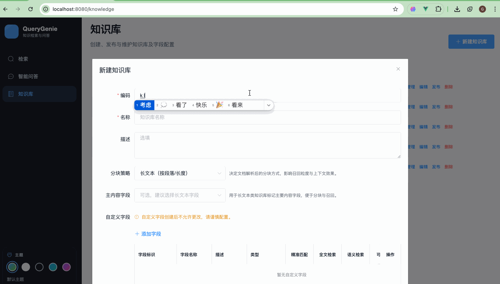
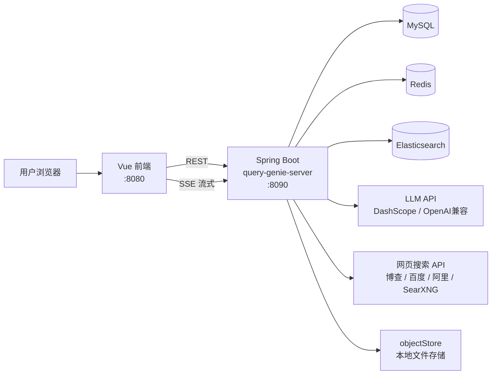
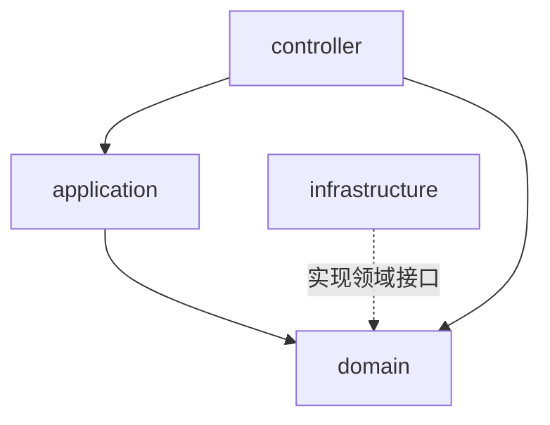
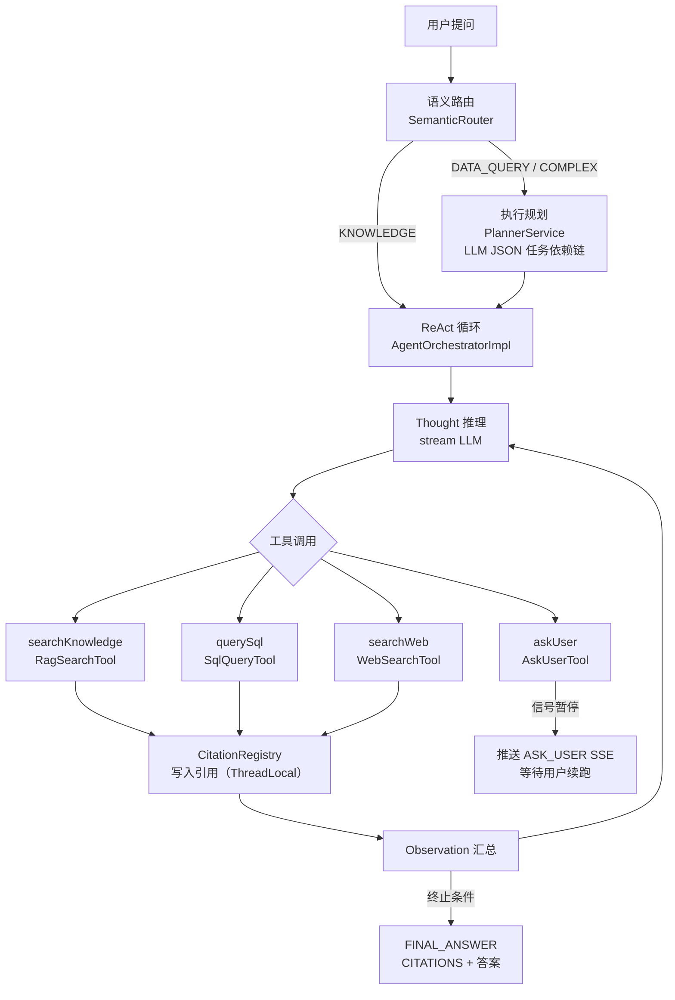
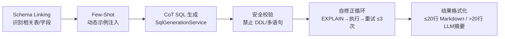

# QueryGenie

面向企业知识库与数据库场景的 **AI 问答** 工程化项目：覆盖文档入库、混合检索、流式问答到多工具 Agent 推理的完整链路，并以 DDD 分层保证长期可扩展性。

**能力概览：** 多格式文档（文档、表格、网页等）；字段权重、时间衰减、混合检索、查询改写、多轮会话；ReAct Agent（知识库检索 + SQL 查询 + 网页搜索 + 追问用户）；SSE 流式步骤推送；引用溯源。

[English README](./README.en.md)

## 效果演示

以下为 QueryGenie 在实际界面中的操作与问答效果录屏（知识库管理、检索与流式回答等）。



## 为什么做这个项目

很多 RAG 示例能「跑起来」，但难以直接用于业务演进。QueryGenie 侧重工程落地：

- **功能闭环**：知识库管理 → 文档解析/分块 → 检索召回 → Rerank → 流式问答 → Agent 多工具推理  
- **架构可演进**：Controller / Application / Domain / Infrastructure 边界清晰  
- **能力可替换**：模型、向量检索、缓存、中间件、网页搜索服务商可在基础设施层替换  

## 这个项目的价值（适合开源）

| 维度 | 说明 |
|------|------|
| 场景价值 | 非单点聊天 Demo，而是覆盖知识库生产链路的完整系统 |
| 工程价值 | DDD 分层 + 架构守卫测试，便于协作与长期重构 |
| 业务价值 | 混合召回、Rerank、流式回答，贴近真实问答体验 |
| Agent 价值 | ReAct 多工具循环 + 追问机制 + 引用溯源，覆盖复杂问题推理场景 |
| 演进价值 | 基础设施抽象清晰，便于扩展模型供应商与检索后端 |

## 核心能力

**知识库问答（RAG）**

- **知识库管理**：创建、编辑、发布、删除；可自定义可检索字段与权重  
- **文档接入**：本地文件 + 远程文档（网页 / 语雀）解析、切块、向量化入库  
- **检索策略**：关键字、向量、混合（RRF）；可选 Rerank；支持时间衰减  
- **智能问答**：基于检索结果的 RAG 问答；SSE 流式返回；多轮会话  

**Agent 推理（ReAct）**

- **语义路由**：自动识别问题类型（知识库 / 数据查询 / 复杂），选择执行策略  
- **执行规划**：复杂问题 LLM 拆解为带依赖的子任务列表  
- **ReAct 循环**：Thought → Action（工具调用）→ Observation 迭代推理  
- **四类工具**：知识库检索、SQL 查询（5步流水线）、网页搜索、追问用户  
- **SQL 查询**：Schema Linking → Few-Shot → CoT 生成 → 安全校验 → 自修正循环（≤3次）→ 结果格式化  
- **网页搜索**：支持 博查AI / 百度AI搜索 / 阿里IQS / SearXNG 多供应商切换  
- **引用溯源**：答案中 [N] 角标可点击，展示对应 KB / SQL / WEB 来源详情  
- **SSE 步骤流**：ROUTING → PLANNING → THINKING → TOOL_CALL → TOOL_RESULT → CITATIONS → FINAL_ANSWER  

## 系统架构

### 部署与数据流

浏览器访问 Vue 前端，前端调用 Spring Boot 的 REST / SSE 接口；后端读写 MySQL、Redis、Elasticsearch，调用外部 LLM / Rerank，上传文档落盘至本地对象存储目录；Agent 模式下还可按需调用网页搜索外部 API。



本地中间件由仓库根目录的 `docker-compose.yml` 编排（MySQL、Redis、Elasticsearch）。**Elasticsearch 需安装 IK 中文分词插件**：索引映射使用 `ik_smart` / `ik_max_word`（见 `KLFieldMappingBuilder`）。`docker compose` 通过 `docker/elasticsearch-ik/Dockerfile` 在构建镜像时安装与 ES 8.18.0 版本匹配的 [analysis-ik](https://github.com/infinilabs/analysis-ik)；首次执行 `./scripts/bootstrap.sh` 或 `docker compose up` 会多一步镜像构建，属正常现象。

### 后端分层（DDD）

业务向内收敛在 `domain`；`infrastructure` 通过实现领域接口接入具体中间件与第三方 API，避免领域层反向依赖实现细节。



### Agent 执行流程



### SQL 查询 5 步流水线



## 仓库目录

仓库为**前后端分离**的单体多模块布局：根目录负责编排依赖与文档，子目录分别为前端与后端工程。

```
AIGenie/
├── query-genie-front/          # Vue 2 前端（页面、路由、API 封装）
├── query-genie-server/         # Spring Boot 后端（DDD 分层）
├── scripts/                    # 本地一键脚本（如 bootstrap.sh）
├── docker/                     # 自定义中间件镜像（含 ES + IK 分词）
├── docker-compose.yml          # MySQL / Redis / Elasticsearch
├── .env.example                # 环境变量模板（复制为 .env）
├── demo.gif                    # 界面与问答效果演示（动图）
├── objectStore/                # 运行时文档落盘目录（默认忽略 objectStore/doc/ 下内容）
├── LICENSE
├── README.md / README.en.md
```

### query-genie-front（前端）

| 路径 | 说明 |
|------|------|
| `src/views/AgentChat.vue` | Agent 对话页（会话侧栏、步骤流式渲染、追问气泡、来源链接） |
| `src/views/Qa.vue` | 传统 RAG 问答页（知识库选择、流式回答、引用来源） |
| `src/views/KnowledgeList.vue` / `KnowledgeDetail.vue` | 知识库列表与详情（文档管理、检索字段配置） |
| `src/views/Search.vue` | 检索测试页（多策略对比） |
| `src/views/Query.vue` | SQL 查询测试页 |
| `src/views/DatasourceList.vue` | 数据源管理页 |
| `src/views/TableSchemaList.vue` / `TableSchemaEdit.vue` | 表结构 Schema 管理页 |
| `src/components/CitationText.vue` | 答案中 [N] 角标渲染（可点击，emit cite-click） |
| `src/components/CitationDrawer.vue` | 引用来源抽屉（KB / SQL / WEB 三类型样式） |
| `src/api/` | 后端接口封装（`agent.js` / `qa.js` / `session.js` / `knowledge.js` 等） |
| `src/router/` | Vue Router 路由配置 |

### query-genie-server（后端）

#### controller 层

| 类 | 说明 |
|------|------|
| `AgentController` | `POST /agent/ask/stream`，SSE 流式 Agent 问答，120s 超时 |
| `QaController` | RAG 问答、流式回答、历史消息查询 |
| `KnowledgeController` | 知识库 CRUD + 发布管理 |
| `DocumentController` | 文档上传、解析任务管理 |
| `QueryController` | SQL 查询接口 |
| `SchemaController` | 数据源与表结构 Schema 管理 |
| `SqlTestController` | 内部 SQL 端到端测试（需开启 `app.internal-api.enabled`） |

#### application 层

| 类 | 说明 |
|------|------|
| `AgentApplication` | Agent 请求路由分派、消息落库（含 `citationsJson`）、会话标题更新 |
| `QaApplication` | RAG 问答用例编排（检索 → Rerank → LLM → 流式回答） |
| `SessionApplication` | 会话 / 消息列表查询、历史引用解析（兼容旧 QA sources） |
| `DocumentApplication` | 文档入库 ETL 流程编排 |
| `KnowledgeApplication` | 知识库生命周期用例 |
| `SchemaApplication` | Schema 同步与缓存刷新 |
| `QueryApplication` | SQL 查询用例 |

#### domain 层

| 子包 | 说明 |
|------|------|
| `agent/routing/` | 语义路由：`SemanticRouter`（关键词规则 + LLM 兜底），`QuestionType`（KNOWLEDGE / DATA_QUERY / COMPLEX） |
| `agent/planning/` | 执行规划：`PlannerService` / `DefaultPlannerService`（LLM JSON 输出），`ExecutionPlan`（任务依赖链 + `toTaskListHint()`） |
| `agent/orchestration/` | ReAct 编排：`AgentOrchestrator` / `AgentOrchestratorImpl`（推理循环 + 流式 LLM），`AgentContext`，`AgentResult`（finalAnswer + citations），`ContextWindowManager`（多轮 Token 压缩） |
| `agent/tool/` | Agent 工具：`RagSearchTool`（KB 检索）、`WebSearchTool`（网页搜索，`@ConditionalOnBean`）、`AskUserTool`（追问，信号字符串暂停） |
| `agent/tool/sql/` | SQL 工具入口：`SqlQueryTool`（四步编排总调用），`SqlExecutor`（接口） |
| `agent/tool/sql/pipeline/` | SQL 5 步流水线：`SchemaLinkingService`、`DynamicFewShotService`、`SqlGenerationService`（CoT）、`SqlSecurityValidator`、`SelfCorrectionLoop`（EXPLAIN + 重试）、`ResultFormatter`、`SchemaContextBuilder` |
| `agent/event/` | SSE 步骤事件：`StepEvent`（ROUTING / PLANNING / THINKING / THOUGHT_CHUNK / TOOL_CALL / TOOL_RESULT / ASK_USER / CITATIONS / FINAL_ANSWER / ERROR），`StepEventPublisher` |
| `agent/citation/` | 引用注册：`CitationRegistry`（ThreadLocal 写入 / drainAndClear），`CitationItem`（KB / SQL / WEB 统一模型） |
| `agent/search/` | 网页搜索领域接口：`WebSearchProvider`、`WebSearchResult` |
| `knowledge/` | 知识库领域模型、仓储接口、字段权重配置 |
| `document/` | 文档领域模型、解析结果 |
| `etlpipeline/` | ETL 流水线（分块、向量化、入库） |
| `qa/` | RAG 问答领域（检索参数、问答结果、多轮上下文） |
| `query/` | SQL 查询领域（数据源、执行结果） |
| `schema/` | 数据库 Schema 领域（表、字段、摘要） |
| `vectorstore/` | 向量存储抽象（索引构建、向量检索、混合检索） |
| `chat/` | 会话 / 消息领域模型（`ChatMessage` 含 `citationsJson` 字段） |

#### infrastructure 层

| 子包 | 说明 |
|------|------|
| `llm/dashscope/` | DashScope LLM 适配（`ChatModel`、`EmbeddingModel`） |
| `llm/openai/` | OpenAI 兼容 LLM 适配（查询改写等） |
| `search/` | 网页搜索供应商：`BochaSearchProvider`、`BaiduAISearchProvider`、`AliIQSSearchProvider`、`SearxngSearchProvider`，由 `WebSearchProviderFactory`（`@ConditionalOnProperty`）按配置创建 Bean |
| `datasource/` | 动态数据源：`DynamicDataSourceManager`（Druid 连接池按需创建 + 缓存，AES 密码解密），`SqlExecutorImpl` |
| `vectorstore/` | Elasticsearch 向量检索实现（IK 分词、混合 RRF、字段权重） |
| `rerank/` | Rerank 服务实现（DashScope 等） |
| `dao/` | MyBatis Mapper 实现（知识库、文档、会话、消息等） |
| `cache/` | Redis 缓存实现 |
| `embedding/` | 向量化服务实现 |
| `objectstore/` | 本地对象存储实现 |
| `api/` | 外部 HTTP 调用（文档解析等） |

### docker/elasticsearch-ik

| 路径 | 说明 |
|------|------|
| `Dockerfile` | 基于官方 `elasticsearch:8.18.0`，构建时安装 IK 插件（版本与 ES 主版本对齐） |

## 能力矩阵

| 维度 | 当前能力 | 说明 |
|------|----------|------|
| 文档入库 | 本地文件 + 网页 / 语雀 | 多格式文档解析、分块、向量化 |
| 召回策略 | Keyword / Vector / Hybrid (RRF) | 可直接对比不同召回策略效果 |
| 结果优化 | DashScope Rerank + 时间衰减 | 提升答案相关性与排序稳定性 |
| 问答体验 | SSE 流式 + 多轮会话 | 接近生产态的人机交互体验 |
| Agent 路由 | 关键词规则 + LLM 兜底 | 自动识别知识库 / 数据查询 / 复杂问题 |
| Agent 规划 | LLM JSON 任务依赖链 | 复杂问题拆解为有序子任务 |
| Agent 工具 | KB 检索 / SQL 查询 / 网页搜索 / 追问 | ReAct 循环多轮推理 |
| SQL 生成 | CoT + 自修正 ≤3次 + 安全校验 | Schema Linking + EXPLAIN 验证 |
| 网页搜索 | 博查 / 百度 / 阿里 / SearXNG | 按配置切换供应商，可选关闭 |
| 引用溯源 | [N] 角标 + 抽屉详情 | KB / SQL / WEB 三类型引用 |
| 架构设计 | DDD 分层 + ArchUnit 约束 | 便于二次开发与长期维护 |

## 架构设计价值

后端采用 DDD 分层，强调「业务逻辑不被基础设施反向污染」：

- `controller`：参数校验与接口编排入口  
- `application`：跨领域流程编排  
- `domain`：核心业务规则与抽象接口  
- `infrastructure`：MySQL / Redis / Elasticsearch / LLM 等具体实现  

项目已包含 ArchUnit 架构约束测试，确保 `domain` / `application` 不直接依赖 `infrastructure.llm`：

- `query-genie-server/src/test/java/com/genie/query/architecture/LlmLayerDependencyArchTest.java`

## 与常见 RAG 示例的区别

- 不只关注「能回答」，还覆盖「如何接入、如何检索、如何持续演进」  
- 不把业务规则耦合在控制层，降低维护成本  
- 不绑定单一实现，方便未来替换 ES、模型或缓存方案  
- 超越 RAG，提供完整 Agent 推理链路（路由 → 规划 → ReAct → 工具 → 引用溯源）  

## 10 分钟快速体验

### 1) 准备环境

- JDK 17+  
- Maven 3.6+  
- Node.js 16+  
- Docker / Docker Compose  

### 2) 配置环境变量

复制示例：

```bash
cp .env.example .env
```

后端已支持自动加载 `.env`（在仓库根目录或 `query-genie-server` 目录均可）。

至少设置：

```bash
export DASHSCOPE_API_KEY=your-dashscope-api-key
```

如启用查询改写的 OpenAI 兼容调用，可额外设置：

```bash
export OPENAI_API_KEY=your-openai-compatible-api-key
```

如启用网页搜索（Agent 工具之一），可选配：

```bash
# 选其一（博查AI 为默认推荐）
export APP_WEB_SEARCH_ENABLED=true
export APP_WEB_SEARCH_PROVIDER=bocha   # bocha / baidu / ali / searxng
export BOCHA_API_KEY=your-bocha-api-key
```

### 3) 拉起依赖并初始化数据库

```bash
./scripts/bootstrap.sh
```

### 4) 启动后端

```bash
cd query-genie-server
mvn spring-boot:run
```

默认地址：`http://localhost:8090/genie/api`

### 5) 启动前端

```bash
cd query-genie-front
npm install
npm run serve
```

访问：`http://localhost:8080`

## 配置说明

- 运行配置：`query-genie-server/src/main/resources/application.yml`  
- 示例配置：`query-genie-server/src/main/resources/application.example.yml`  
- 数据初始化：`query-genie-server/src/main/resources/sql/init.sql`  
- 中间件编排：`docker-compose.yml`  

### Elasticsearch 与 IK 分词

- **为何需要 IK**：全文检索字段使用 `ik_smart` 等分析器，未安装插件时创建索引会失败。  
- **Docker Compose**：`elasticsearch` 服务使用本仓库构建的镜像 `query-genie-elasticsearch:8.18.0-ik`，无需再进容器手动执行 `elasticsearch-plugin install`。  
- **自建或托管 ES**：须自行安装与集群 **Elasticsearch 主版本完全一致** 的 IK 包，可参考 [infinilabs/analysis-ik](https://github.com/infinilabs/analysis-ik)（示例：`bin/elasticsearch-plugin install --batch "https://get.infini.cloud/elasticsearch/analysis-ik/<你的ES版本>"`）。升级 `docker-compose.yml` 中的 ES 版本时，请同步修改 `docker/elasticsearch-ik/Dockerfile` 中的插件 URL 版本号。  
- **从旧版 compose 升级**：若此前使用官方无 IK 镜像，请执行 `docker compose build elasticsearch && docker compose up -d`（或再次运行 `./scripts/bootstrap.sh`）以用新镜像重建 `genie-es`；若历史索引在无 IK 环境下创建失败，可在业务允许时删除对应索引后由应用重建。  

### 网页搜索供应商

| 供应商 | 配置值 | 所需环境变量 | 说明 |
|--------|--------|------------|------|
| 博查AI | `bocha` | `BOCHA_API_KEY` | 默认推荐，中文搜索效果好 |
| 百度AI搜索 | `baidu` | `BAIDU_AI_SEARCH_API_KEY` | 百度千帆平台 |
| 阿里IQS | `ali` | `ALI_IQS_API_KEY` | 阿里云智能搜索 |
| SearXNG | `searxng` | `SEARXNG_BASE_URL` | 免费自托管，无需 API Key |

## 开源许可

本项目使用 [MIT License](./LICENSE)。
