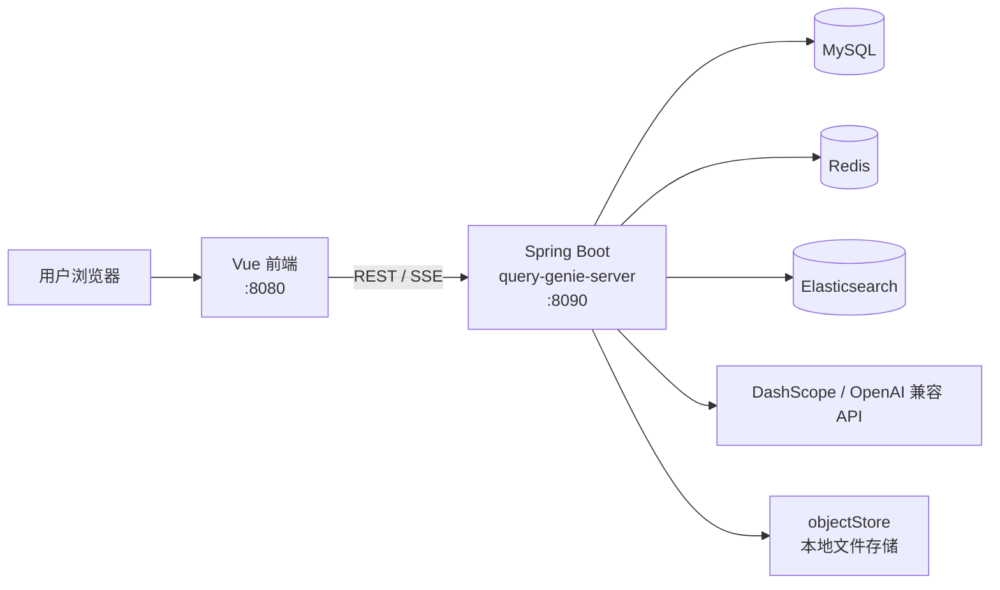
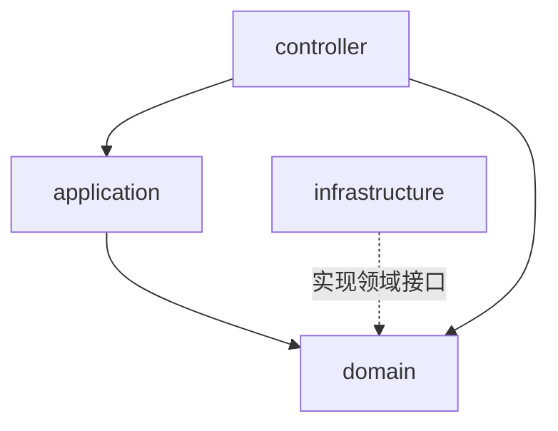

# QueryGenie

面向企业知识库与数据库场景的 **AI 问答** 工程化项目：覆盖文档入库、混合检索到流式问答的完整链路，并以 DDD 分层保证长期可扩展性。

**能力概览：** 多格式文档（文档、表格、网页等）；字段权重、时间衰减、混合检索、查询改写、多轮会话。

[English README](./README.en.md)

## 效果演示

以下为 QueryGenie 在实际界面中的操作与问答效果录屏（知识库管理、检索与流式回答等）。


## 为什么做这个项目

很多 RAG 示例能「跑起来」，但难以直接用于业务演进。QueryGenie 侧重工程落地：

- **功能闭环**：知识库管理 → 文档解析/分块 → 检索召回 → Rerank → 流式问答  
- **架构可演进**：Controller / Application / Domain / Infrastructure 边界清晰  
- **能力可替换**：模型、向量检索、缓存、中间件可在基础设施层替换  

## 这个项目的价值（适合开源）

| 维度 | 说明 |
|------|------|
| 场景价值 | 非单点聊天 Demo，而是覆盖知识库生产链路的完整系统 |
| 工程价值 | DDD 分层 + 架构守卫测试，便于协作与长期重构 |
| 业务价值 | 混合召回、Rerank、流式回答，贴近真实问答体验 |
| 演进价值 | 基础设施抽象清晰，便于扩展模型供应商与检索后端 |

## 核心能力

- **知识库管理**：创建、编辑、发布、删除；可自定义可检索字段与权重  
- **文档接入**：本地文件 + 远程文档（网页 / 语雀）解析、切块、向量化入库  
- **检索策略**：关键字、向量、混合（RRF）；可选 Rerank；支持时间衰减  
- **智能问答**：基于检索结果的 RAG 问答；SSE 流式返回；多轮会话  

## 系统架构

### 部署与数据流

浏览器访问 Vue 前端，前端调用 Spring Boot 的 REST / SSE 接口；后端读写 MySQL、Redis、Elasticsearch，调用外部 LLM / Rerank，上传文档落盘至本地对象存储目录。



本地中间件由仓库根目录的 `docker-compose.yml` 编排（MySQL、Redis、Elasticsearch）。**Elasticsearch 需安装 IK 中文分词插件**：索引映射使用 `ik_smart` / `ik_max_word`（见 `KLFieldMappingBuilder`）。`docker compose` 通过 `docker/elasticsearch-ik/Dockerfile` 在构建镜像时安装与 ES 8.18.0 版本匹配的 [analysis-ik](https://github.com/infinilabs/analysis-ik)；首次执行 `./scripts/bootstrap.sh` 或 `docker compose up` 会多一步镜像构建，属正常现象。

### 后端分层（DDD）

业务向内收敛在 `domain`；`infrastructure` 通过实现领域接口接入具体中间件与第三方 API，避免领域层反向依赖实现细节。



## 仓库目录

仓库为**前后端分离**的单体多模块布局：根目录负责编排依赖与文档，子目录分别为前端与后端工程。

```
AIGenie/
├── query-genie-front/          # Vue 2 前端（页面、路由、API 封装）
├── query-genie-server/         # Spring Boot 后端（DDD 分层）
├── scripts/                    # 本地一键脚本（如 bootstrap.sh）
├── docker/                     # 自定义中间件镜像（含 ES + IK 分词）
├── docker-compose.yml          # MySQL / Redis / Elasticsearch
├── .env.example                # 环境变量模板（复制为 .env）
├── demo.gif                    # 界面与问答效果演示（动图）
├── objectStore/                # 运行时文档落盘目录（默认忽略 objectStore/doc/ 下内容）
├── LICENSE
├── README.md / README.en.md
```

### query-genie-front（前端）

| 路径 | 说明 |
|------|------|
| `src/views/` | 页面（知识库、问答、详情等） |
| `src/api/` | 后端接口封装 |
| `src/router/` | 路由 |
| `public/` | 静态资源 |

### query-genie-server（后端）

| 路径 | 说明 |
|------|------|
| `src/main/java/.../controller/` | HTTP 入参校验与对外 API |
| `src/main/java/.../application/` | 用例编排（跨领域流程） |
| `src/main/java/.../domain/` | 领域模型与服务抽象（knowledge、document、query、qa、etlpipeline、vectorstore 等） |
| `src/main/java/.../infrastructure/` | MyBatis、Redis、ES、LLM、Rerank、对象存储等具体实现 |
| `src/main/resources/mapper/` | MyBatis XML |
| `src/main/resources/sql/` | 表结构初始化脚本 |
| `src/test/java/.../architecture/` | ArchUnit 等架构约束测试 |

### docker/elasticsearch-ik

| 路径 | 说明 |
|------|------|
| `Dockerfile` | 基于官方 `elasticsearch:8.18.0`，构建时安装 IK 插件（版本与 ES 主版本对齐） |

## 能力矩阵

| 维度 | 当前能力 | 开源价值 |
|------|----------|----------|
| 文档入库 | 本地文件 + 网页/语雀 | 便于复用到不同业务知识源 |
| 召回策略 | Keyword / Vector / Hybrid (RRF) | 可直接对比不同召回策略效果 |
| 结果优化 | DashScope Rerank | 提升答案相关性与排序稳定性 |
| 问答体验 | SSE 流式 + 多轮会话 | 接近生产态的人机交互体验 |
| 架构设计 | DDD 分层 + ArchUnit 约束 | 便于二次开发与长期维护 |

## 架构设计价值

后端采用 DDD 分层，强调「业务逻辑不被基础设施反向污染」：

- `controller`：参数校验与接口编排入口  
- `application`：跨领域流程编排  
- `domain`：核心业务规则与抽象接口  
- `infrastructure`：MySQL / Redis / Elasticsearch / LLM 等具体实现  

项目已包含 ArchUnit 架构约束测试，确保 `domain` / `application` 不直接依赖 `infrastructure.llm`：

- `query-genie-server/src/test/java/com/genie/query/architecture/LlmLayerDependencyArchTest.java`

## 与常见 RAG 示例的区别

- 不只关注「能回答」，还覆盖「如何接入、如何检索、如何持续演进」  
- 不把业务规则耦合在控制层，降低维护成本  
- 不绑定单一实现，方便未来替换 ES、模型或缓存方案  

## 10 分钟快速体验

### 1) 准备环境

- JDK 17+  
- Maven 3.6+  
- Node.js 16+  
- Docker / Docker Compose  

### 2) 配置环境变量

复制示例：

```bash
cp .env.example .env
```

后端已支持自动加载 `.env`（在仓库根目录或 `query-genie-server` 目录均可）。

至少设置：

```bash
export DASHSCOPE_API_KEY=your-dashscope-api-key
```

如启用查询改写的 OpenAI 兼容调用，可额外设置：

```bash
export OPENAI_API_KEY=your-openai-compatible-api-key
```

### 3) 拉起依赖并初始化数据库

```bash
./scripts/bootstrap.sh
```

### 4) 启动后端

```bash
cd query-genie-server
mvn spring-boot:run
```

默认地址：`http://localhost:8090/genie/api`

### 5) 启动前端

```bash
cd query-genie-front
npm install
npm run serve
```

访问：`http://localhost:8080`

## 配置说明

- 运行配置：`query-genie-server/src/main/resources/application.yml`  
- 示例配置：`query-genie-server/src/main/resources/application.example.yml`  
- 数据初始化：`query-genie-server/src/main/resources/sql/init.sql`  
- 中间件编排：`docker-compose.yml`  

### Elasticsearch 与 IK 分词

- **为何需要 IK**：全文检索字段使用 `ik_smart` 等分析器，未安装插件时创建索引会失败。  
- **Docker Compose**：`elasticsearch` 服务使用本仓库构建的镜像 `query-genie-elasticsearch:8.18.0-ik`，无需再进容器手动执行 `elasticsearch-plugin install`。  
- **自建或托管 ES**：须自行安装与集群 **Elasticsearch 主版本完全一致** 的 IK 包，可参考 [infinilabs/analysis-ik](https://github.com/infinilabs/analysis-ik)（示例：`bin/elasticsearch-plugin install --batch "https://get.infini.cloud/elasticsearch/analysis-ik/<你的ES版本>"`）。升级 `docker-compose.yml` 中的 ES 版本时，请同步修改 `docker/elasticsearch-ik/Dockerfile` 中的插件 URL 版本号。  
- **从旧版 compose 升级**：若此前使用官方无 IK 镜像，请执行 `docker compose build elasticsearch && docker compose up -d`（或再次运行 `./scripts/bootstrap.sh`）以用新镜像重建 `genie-es`；若历史索引在无 IK 环境下创建失败，可在业务允许时删除对应索引后由应用重建。  

## 开源许可

本项目使用 [MIT License](./LICENSE)。
